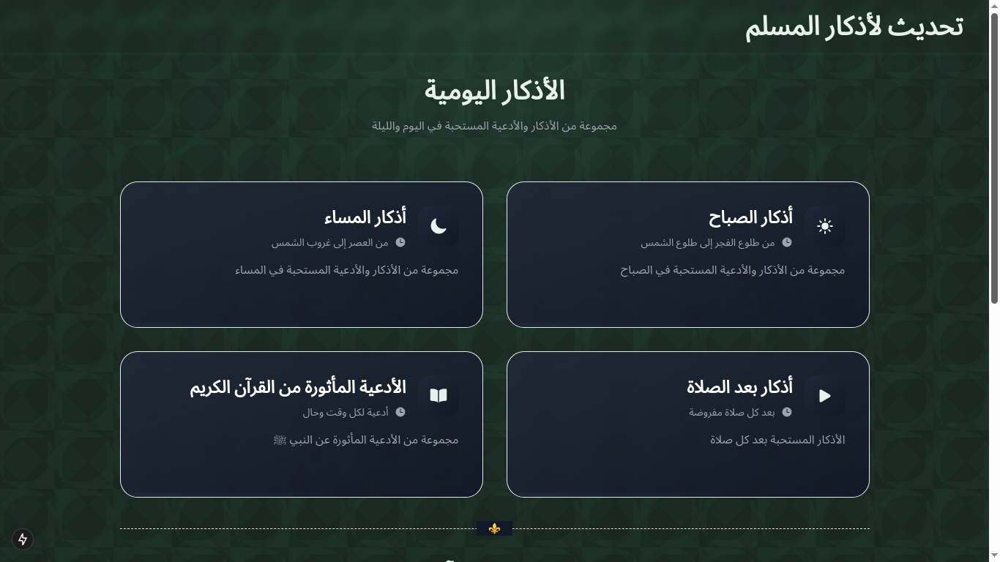
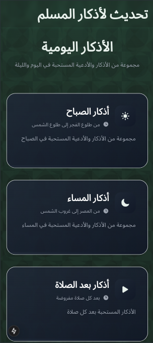
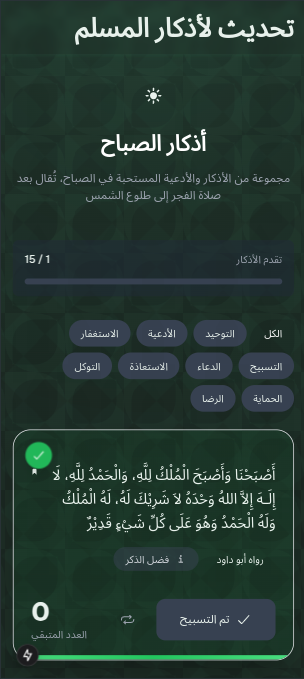
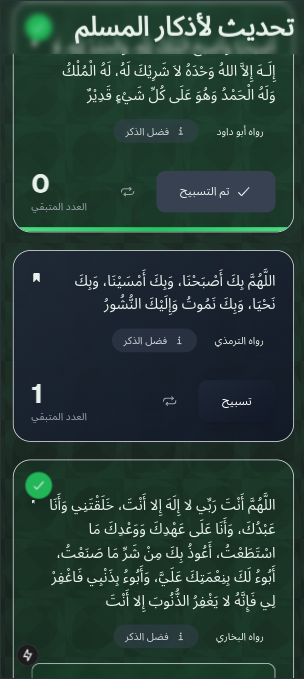
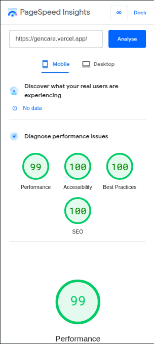
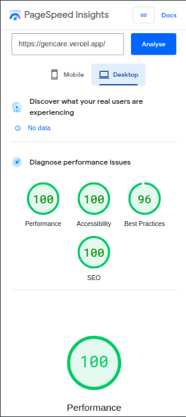

# Athkar - Daily Adhkar & Quran Learning App



Athkar is an interactive web application that displays daily Adhkar and authentic supplications along with Quran learning features. Built with **Next.js**, it offers a modern UI and an enhanced user experience.

## ✨ Features
- Morning and Evening Adhkar
- Post-Prayer Adhkar
- Authentic supplications from the Quran and Sunnah
- Tajweed lessons and articulation points
- Attractive and interactive user interface
- Dark Mode support
- Smooth animations and visual effects

## 🛠 Tech Stack
- **Next.js**
- **React**
- **Tailwind CSS**
- **Framer Motion**
- **React Icons**

## 🖼 Screenshots
<div align="center">
  
  
    
  
</div>

## 🚀 Website Performance 

<div align="center">
  
  
</div>


## 🚀 Running Locally

Clone the repository:

```bash
git clone https://github.com/ahmed-838/azkar.git
```

Navigate to the project directory:

```bash
cd azkar
```

Install dependencies:

```bash
npm install  # or yarn install
```

Start the development server:

```bash
npm run dev  # or yarn dev
```

Open your browser and visit:

```
http://localhost:3000
```

## 🌍 Live Demo
Access the live application here: [Live Demo](#)

## 🤝 Contributing
We welcome contributions! Follow these steps to contribute:

1. **Fork** the repository
2. Create a new branch:
   ```bash
   git checkout -b feature/AmazingFeature
   ```
3. Commit your changes:
   ```bash
   git commit -m 'Add some AmazingFeature'
   ```
4. Push to the branch:
   ```bash
   git push origin feature/AmazingFeature
   ```
5. Open a **Pull Request**

## 📜 License
This project is licensed under the **MIT License**.

---
<div align="center">
  <sub>Made with ❤️ by <a href="https://github.com/ahmed-838">Ahmed Abd Elmohsen</a></sub>
</div>
